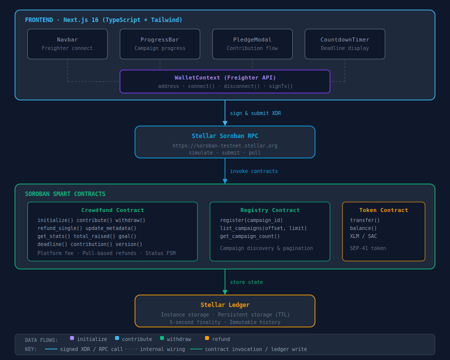

# Fund-My-Cause Architecture

A comprehensive guide to the system design, data model, and component interactions in the Fund-My-Cause decentralized crowdfunding platform.

## System Overview

Fund-My-Cause is a decentralized crowdfunding platform built on the Stellar network using Soroban smart contracts. The system enables creators to launch campaigns, accept contributions in XLM or custom tokens, and automatically release or refund funds based on campaign success.

### Architecture Diagram



## Smart Contract Data Model

### Storage Architecture

The contract uses two types of Soroban storage:

#### Instance Storage (Persistent)
Stores campaign metadata and configuration. Survives contract lifetime.

**Storage Keys:**
- `KEY_CREATOR` (Address) - Campaign creator's Stellar address
- `KEY_TOKEN` (Address) - Token address for contributions
- `KEY_GOAL` (i128) - Funding goal in stroops
- `KEY_DEADLINE` (u64) - Campaign deadline (Unix timestamp, seconds)
- `KEY_TOTAL` (i128) - Total amount raised in stroops
- `KEY_STATUS` (Status) - Current campaign status
- `KEY_MIN` (i128) - Minimum contribution amount in stroops
- `KEY_TITLE` (String) - Campaign title
- `KEY_DESC` (String) - Campaign description
- `KEY_SOCIAL` (Vec<String>) - Social media links
- `KEY_PLATFORM` (PlatformConfig) - Optional platform fee configuration
- `KEY_ADMIN` (Address) - Admin address (same as creator)
- `DataKey::ContributorCount` (u32) - Number of unique contributors
- `DataKey::LargestContribution` (i128) - Largest single contribution
- `DataKey::AcceptedTokens` (Vec<Address>) - Whitelist of accepted tokens

#### Persistent Storage (Ledger Entries)
Stores per-contributor data with TTL management.

**Storage Keys:**
- `DataKey::Contribution(Address)` (i128) - Contribution amount per contributor
- `DataKey::ContributorPresence(Address)` (bool) - Whether address has contributed
- `KEY_CONTRIBS` (Vec<Address>) - List of all contributor addresses

### Data Types

#### Status Enum
```rust
pub enum Status {
    Active,      // Campaign accepting contributions
    Successful,  // Deadline passed, goal reached
    Refunded,    // Deadline passed, goal not reached
    Cancelled,   // Creator cancelled campaign
    Paused,      // Campaign temporarily paused
}
```

#### CampaignStats
```rust
pub struct CampaignStats {
    pub total_raised: i128,              // Total raised in stroops
    pub goal: i128,                      // Goal in stroops
    pub progress_bps: u32,               // Progress in basis points (0-10000)
    pub contributor_count: u32,          // Number of unique contributors
    pub average_contribution: i128,      // Average contribution in stroops
    pub largest_contribution: i128,      // Largest single contribution
}
```

#### PlatformConfig
```rust
pub struct PlatformConfig {
    pub address: Address,                // Fee recipient address
    pub fee_bps: u32,                    // Fee in basis points (0-10000)
}
```

#### CampaignInfo
```rust
pub struct CampaignInfo {
    pub creator: Address,
    pub token: Address,
    pub goal: i128,
    pub deadline: u64,
    pub min_contribution: i128,
    pub title: String,
    pub description: String,
    pub status: Status,
    pub has_platform_config: bool,
    pub platform_fee_bps: u32,
    pub platform_address: Address,
}
```

## Contract State Machine

### Status Transitions

```
                    ┌─────────────────────────────────┐
                    │                                 │
                    ▼                                 │
              ┌──────────────┐                        │
              │    Active    │◄───────────────────────┘
              └──────┬───────┘                   unpause()
                     │
        ┌────────────┼────────────┐
        │            │            │
   pause()      deadline      cancel_campaign()
        │        passes           │
        │            │            │
        ▼            ▼            ▼
    ┌────────┐  ┌──────────┐  ┌──────────┐
    │ Paused │  │ Deadline │  │Cancelled │
    └────────┘  │ Reached? │  └──────────┘
        │       └──────────┘        │
        │            │              │
        │       ┌────┴────┐         │
        │       │         │         │
        │       ▼         ▼         │
        │    ┌────────┐ ┌────────┐  │
        │    │Success │ │Refunded│  │
        │    └────────┘ └────────┘  │
        │       │         │         │
        └───────┴─────────┴─────────┘
              withdraw() or refund_single()
```

### State Transition Rules

| From | To | Condition | Function |
|------|----|-----------| ---------|
| Active | Paused | Admin calls pause() | `pause()` |
| Paused | Active | Admin calls unpause() | `unpause()` |
| Active | Cancelled | Creator calls cancel_campaign() | `cancel_campaign()` |
| Active | Successful | Deadline passed + goal reached + creator calls withdraw() | `withdraw()` |
| Active | Refunded | Deadline passed + goal not reached (implicit) | `refund_single()` |
| Cancelled | - | Contributors claim refunds | `refund_single()` |
| Refunded | - | Contributors claim refunds | `refund_single()` |

## Frontend Component Tree

```
App
├── WalletProvider
│   ├── ThemeProvider
│   │   ├── Navbar
│   │   │   ├── ConnectButton
│   │   │   └── ThemeToggle
│   │   ├── CampaignList
│   │   │   ├── CampaignCard (multiple)
│   │   │   │   ├── ProgressBar
│   │   │   │   ├── CountdownTimer
│   │   │   │   └── PledgeButton
│   │   │   └── Pagination
│   │   ├── CampaignDetail
│   │   │   ├── CampaignHeader
│   │   │   ├── ProgressBar
│   │   │   ├── CountdownTimer
│   │   │   ├── ContributorList
│   │   │   ├── PledgeModal
│   │   │   └── WithdrawButton (if creator)
│   │   └── CreateCampaign
│   │       ├── FormInput
│   │       ├── DatePicker
│   │       └── SubmitButton
│   └── Toast (notifications)
```

### Key Components

#### WalletContext
- **Purpose**: Manages Freighter wallet connection and transaction signing
- **State**: address, isConnecting, isAutoConnecting, error, networkMismatch
- **Methods**: connect(), disconnect(), signTx()
- **Features**: Auto-restore from sessionStorage, network validation

#### ThemeContext
- **Purpose**: Manages dark/light theme preference
- **State**: theme ("dark" or "light")
- **Methods**: toggleTheme()
- **Features**: Persists to localStorage, respects system preference

#### useCampaign Hook
- **Purpose**: Fetches and manages campaign data
- **State**: info, loading, error
- **Methods**: refresh()
- **Features**: Auto-refetch on contractId change, cancellation support

## Data Flow

### User Action → Wallet Sign → RPC Submit → UI Update

#### Contribution Flow

```
1. User clicks "Pledge" button
   ↓
2. PledgeModal opens, user enters amount
   ↓
3. User clicks "Contribute"
   ↓
4. Frontend builds transaction XDR
   - Method: contribute(contributor, amount, token)
   - Caller: user's wallet address
   ↓
5. Frontend simulates transaction
   - Estimates resource fees
   - Detects contract errors early
   - Returns prepared XDR
   ↓
6. Frontend requests wallet signature
   - Calls Freighter signTransaction()
   - User approves in wallet extension
   ↓
7. Frontend submits signed transaction
   - Sends to Soroban RPC
   - Polls for confirmation (max 20 attempts, 1.5s each)
   ↓
8. Contract executes
   - Validates contribution amount
   - Transfers tokens from contributor to contract
   - Updates contributor's total
   - Increments contributor count if first contribution
   - Publishes "contributed" event
   ↓
9. Frontend receives confirmation
   - Updates UI with new total raised
   - Shows success toast
   - Refreshes campaign stats
```

#### Withdrawal Flow (Creator)

```
1. Creator clicks "Withdraw Funds"
   ↓
2. Frontend checks conditions
   - Deadline passed?
   - Goal reached?
   - Creator authorized?
   ↓
3. Frontend builds transaction XDR
   - Method: withdraw()
   - Caller: creator's wallet address
   ↓
4. Frontend simulates and signs (same as contribution)
   ↓
5. Contract executes
   - Validates deadline passed
   - Validates goal reached
   - Calculates platform fee (if configured)
   - Transfers fee to platform address
   - Transfers remaining to creator
   - Sets status to Successful
   ↓
6. Frontend updates UI
   - Shows withdrawal confirmation
   - Updates campaign status
```

#### Refund Flow (Contributor)

```
1. Contributor clicks "Claim Refund"
   ↓
2. Frontend checks conditions
   - Campaign cancelled OR (deadline passed AND goal not reached)?
   ↓
3. Frontend builds transaction XDR
   - Method: refund_single(contributor)
   - Caller: contributor's wallet address
   ↓
4. Frontend simulates and signs
   ↓
5. Contract executes
   - Validates refund eligibility
   - Transfers refund amount to contributor
   - Sets contributor's balance to 0
   - Publishes "refunded" event
   ↓
6. Frontend updates UI
   - Shows refund confirmation
   - Updates contributor's balance
```

## Registry Contract Design

The Registry contract enables campaign discovery and management.

### Registry Functions

#### register(campaign_id: Address)
Registers a campaign contract ID in the registry.

**Parameters:**
- `campaign_id` - Address of the crowdfund contract to register

**Returns:** Ok(()) on success

**Side Effects:**
- Adds campaign to registry list
- Publishes "registered" event

#### list_campaigns(offset: u32, limit: u32) -> Vec<Address>
Returns a paginated list of registered campaign contract IDs.

**Parameters:**
- `offset` - Starting index (0-based)
- `limit` - Maximum results (capped at 50)

**Returns:** Vector of campaign contract addresses

#### campaign_count() -> u32
Returns the total number of registered campaigns.

**Returns:** Total count

### Registry Storage

- `campaigns` (Vec<Address>) - List of all registered campaign contract IDs
- `campaign_count` (u32) - Total number of campaigns

## Security Assumptions and Trust Model

### Trust Model

1. **Creator Trust**: Creators are trusted to:
   - Set reasonable campaign parameters
   - Not abuse pause/unpause functionality
   - Withdraw funds only when eligible

2. **Contributor Trust**: Contributors are trusted to:
   - Provide valid wallet addresses
   - Understand campaign terms before contributing
   - Claim refunds when eligible

3. **Platform Trust**: Platform is trusted to:
   - Set reasonable fee percentages (0-100%)
   - Not modify contract code after deployment
   - Maintain registry accuracy

### Security Assumptions

1. **Stellar Network Security**
   - Assumes Stellar consensus is secure
   - Assumes ledger timestamps are accurate
   - Assumes token contracts are properly implemented

2. **Wallet Security**
   - Assumes Freighter wallet is secure
   - Assumes user private keys are protected
   - Assumes user approves transactions intentionally

3. **Contract Immutability**
   - Contract code cannot be modified after deployment
   - Contract address is permanent
   - Storage is persistent across invocations

### Security Features

1. **Authorization**
   - All state-changing operations require caller authorization
   - Creator must authorize initialization, withdrawal, metadata updates
   - Contributors must authorize contributions and refunds

2. **Validation**
   - Goal must be > 0
   - Deadline must be in future
   - Minimum contribution must be >= 0
   - Platform fee must be <= 10,000 bps (100%)
   - Contribution amount must be >= minimum

3. **Pull-Based Refunds**
   - Each contributor claims their own refund
   - Avoids single-transaction failure at scale
   - Prevents gas limit issues with many contributors

4. **Token Whitelist**
   - Optional whitelist of accepted tokens
   - Prevents accidental contributions in wrong token
   - Falls back to default token if no whitelist

5. **Platform Fee Deduction**
   - Fee calculated as: `(total_raised * fee_bps) / 10_000`
   - Deducted before creator payout
   - Prevents fee manipulation

### Potential Risks

1. **Ledger Entry Expiration**
   - Persistent storage entries have TTL
   - Contributions may expire if not extended
   - Mitigation: Contract extends TTL on each contribution

2. **Token Contract Failure**
   - If token contract is malicious, transfers may fail
   - Mitigation: Use well-known, audited token contracts

3. **Deadline Manipulation**
   - Creator can extend deadline indefinitely
   - Mitigation: Governance or time limits (future enhancement)

4. **Platform Fee Abuse**
   - Platform could set very high fees
   - Mitigation: Transparent fee configuration, community oversight

## Deployment Architecture

### Testnet Deployment

1. Deploy Crowdfund contract
2. Deploy Registry contract
3. Initialize Crowdfund with test parameters
4. Register campaign in Registry
5. Configure frontend with contract IDs

### Mainnet Deployment

1. Audit contract code
2. Deploy Crowdfund contract
3. Deploy Registry contract
4. Initialize with production parameters
5. Verify contracts on Stellar Expert
6. Update frontend environment variables
7. Monitor contract events

## Performance Considerations

### Gas Optimization

1. **Contribution**: ~5,000-10,000 stroops
2. **Withdrawal**: ~3,000-5,000 stroops
3. **Refund**: ~2,000-4,000 stroops
4. **Metadata Update**: ~1,000-2,000 stroops

### Scalability

1. **Contributor Limit**: No hard limit, but pagination recommended
2. **Campaign Limit**: Registry can handle thousands of campaigns
3. **Storage**: Instance storage is limited; persistent storage scales better

### Optimization Strategies

1. Use pagination for large contributor lists
2. Cache campaign stats on frontend
3. Batch refund claims when possible
4. Use persistent storage for contributor data

## Future Enhancements

1. **Multi-Token Support**: Accept multiple tokens simultaneously
2. **Milestone-Based Funding**: Release funds at milestones
3. **Governance**: DAO-based campaign approval
4. **Reputation System**: Track creator/contributor history
5. **Escrow Service**: Third-party fund management
6. **Insurance**: Protect against creator fraud
7. **Secondary Market**: Trade campaign tokens
8. **Staking**: Earn rewards for participation
